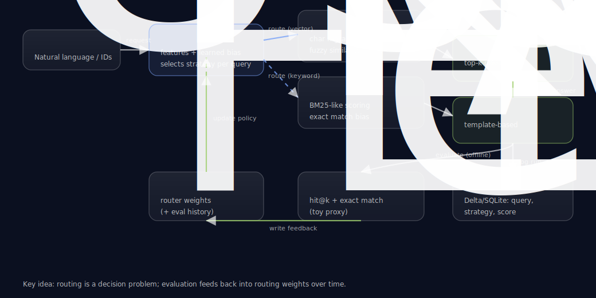
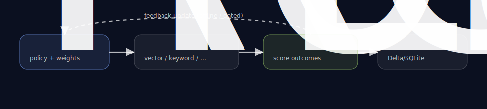

# beyond-vector-search

**Beyond vector search**: a tiny, runnable reference implementation of an **adaptive retrieval router** (vector vs keyword vs hybrid) with an **evaluation feedback loop** and **local SQLite telemetry**—built to illustrate how "learned retrieval" fits into agentic RAG systems.

[](https://medium.com/@sumoaps/beyond-vector-search-building-an-adaptive-retrieval-router-for-agentic-ai-systems-1af6b059826f)


---

## 📖 Blog Post

**[Beyond Vector Search: Building an Adaptive Retrieval Router for Agentic AI Systems](https://medium.com/@sumoaps/beyond-vector-search-building-an-adaptive-retrieval-router-for-agentic-ai-systems-1af6b059826f)**

A detailed walkthrough covering:
- Why static retrieval breaks in agentic workflows (compounding errors)
- How the adaptive router chooses between keyword, vector, and hybrid strategies
- Query feature extraction and the decision formula
- The feedback loop that makes retrieval learnable
- Industry example: fintech chargebacks
- Common mistakes and failure modes in production

👉 **[Read the full post on Medium →](https://medium.com/@sumoaps/beyond-vector-search-building-an-adaptive-retrieval-router-for-agentic-ai-systems-1af6b059826f)**

---

- Architecture diagram: open `diagrams/architecture.html` locally (or via GitHub Pages).
- No external downloads, no network calls, CPU-only.

## Architecture

**High-level architecture (rendered in GitHub):**



**Feedback loop (why this is “learned retrieval”):**



For the interactive/self-contained version, open `diagrams/architecture.html`.

## Story: why routing matters (industry example — fintech chargebacks)

Imagine a **fintech payments ops agent** helping analysts investigate chargebacks.

The workflow is inherently multi-step:
- Step 1: “Pull context for dispute `CB-774193` on txn `TID-88410291`.”
- Step 2: “Why was it flagged as ‘duplicate presentment’?”
- Step 3: “Show similar disputes and the playbook that resolved them.”

Where static retrieval breaks:
- Those IDs (`CB-…`, `TID-…`) are **rare tokens**. If a fuzzy retriever misses them and returns generic “chargeback overview” docs, the agent’s next-step reasoning is anchored on the wrong case.
- That wrong context compounds: the agent picks the wrong policy, sends the wrong follow-up query, and drifts further from the actual dispute record.

With **adaptive retrieval routing**, the system behaves more like a real ops tool:
- **Keyword/BM25-like** for ID-heavy lookups (exact match bias: case IDs, txn IDs)
- **Vector-ish similarity** for paraphrased policy questions (“what counts as duplicate presentment?”)
- **Hybrid** when the query mixes IDs + natural language (retrieve the case *and* the relevant policy)
- **Feedback loop**: evaluation outcomes update routing weights so the system improves rather than repeating the same failure mode

Core benefit: **retrieval stops being a static dependency and becomes a measurable decision layer** in an agentic workflow.

## Quickstart (CPU, end-to-end)

Prereqs: **Python 3.11+**

### Option A (pip editable install)

```bash
python3 -m pip install -e .
python -m beyond_vector_search.run --query "What does BM25 do?"
python -m beyond_vector_search.evaluate
```

### Option B (Databricks notebook)

- Open `notebooks/demo.py` in Databricks Repos
- The notebook runs end-to-end: single query, offline evaluation, telemetry inspection
- **Default backend**: SQLite (no setup needed)
- **Optional**: Use [Lakebase Postgres](https://docs.databricks.com/aws/en/oltp/instances/create/) for production (set `BVS_TELEMETRY=lakebase`)

> **Note:** The notebook uses Databricks-native format. For non-Databricks environments, use Option A (CLI).

## What this is / isn’t

- **This is**: a minimal system showing routing + retrievers + evaluation + feedback + logging.
- **This isn’t**: a production RAG stack, a benchmark, or an LLM-backed QA system (answering is template-based).

## What it does

- Three retrieval strategies:
  - **Vector**: character n‑gram TF‑IDF cosine similarity (fuzzy similarity, CPU-friendly).
  - **Keyword**: BM25-like scoring (term-frequency + IDF, exact match bias).
  - **Hybrid**: a simple blend of keyword + vector signals (safer default for mixed queries).
- **Router** chooses a strategy per query using:
  - query features (length, digit/ID presence, “rare token” ratio, etc.)
  - learned weights updated from past evaluation outcomes (simple bandit-style weight update)
- **Evaluation**: runs a labeled query set (bundled), logs results, and updates routing weights.
- **Logging**: SQLite DB at `runs/beyond_vector_search.sqlite`.

## Metrics (what to watch)

- **Retrieval accuracy proxy**: hit@k (did we retrieve the expected document?)
- **Answer exact match**: template answer vs expected (toy but deterministic)
- **Router quality**: win-rate of chosen strategy vs alternative; regret over time
- **Systems**: latency per stage (toy), routing distribution drift

## Repo layout

```
src/beyond_vector_search/   package code
data/                      toy corpus + labeled queries
diagrams/                  self-contained HTML architecture diagram
docs/                      talk abstract + FAQ + one-slide summary + checklists
tests/                     unit tests (stdlib unittest)
runs/                       created on first run (SQLite DB)
```

## Roadmap (pragmatic next steps)

- Add a **third** strategy (hybrid or metadata filter) and learn over more arms
- Replace toy evaluator with **LLM-graded** faithfulness / citation checks (offline)
- Introduce **per-tenant / per-domain** policies and drift detection
- Add **query clustering** and policy specialization (mixture-of-experts routing)

## License

MIT — see `LICENSE`.


